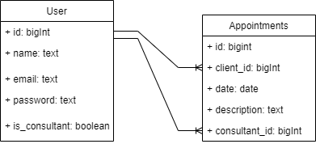
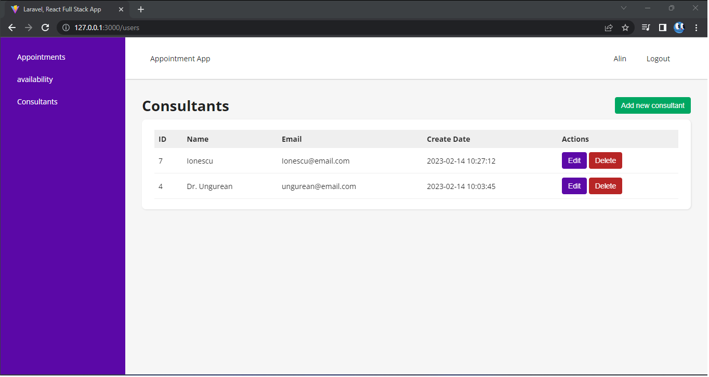
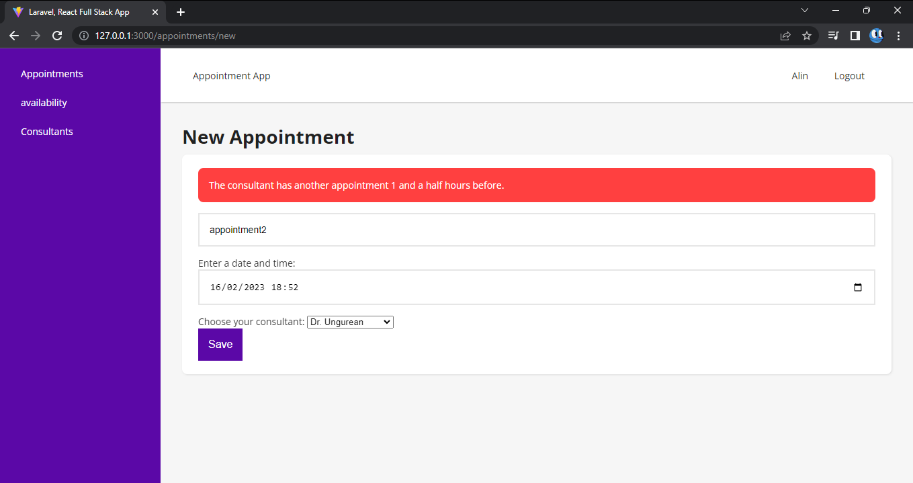

# APPointments

## UML


## Technologies
Project is created with:
* Laravel version: 9.51.0
* React version: 6.14.12
* Postgresql version: 14

## Setup
(For front-end)
To run this project, install it locally using npm:

```
$ cd ../FrontEnd
$ npm install
$ npm run dev
```
(For back-end)
To run this project, install it locally :

```
Rename .env.example file to .envinside your project root and fill the database information. (windows wont let you do it, so you have to open your console cd your project root directory and run mv .env.example .env )
Open the console and cd your project root directory
Run composer install or php composer.phar install
Run php artisan key:generate
Run php artisan migrate
Run php artisan db:seed to run seeders, if any.
Run php artisan serve
```

## Examples

As you can see, you can not creat another appointment in less then 1 and a half hours between them



